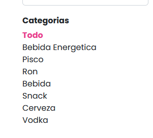
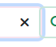
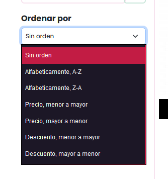
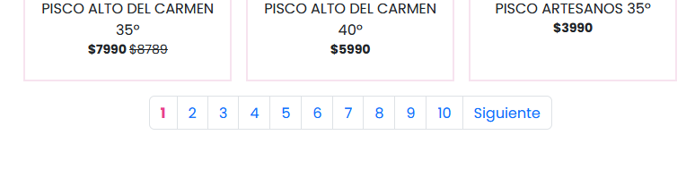
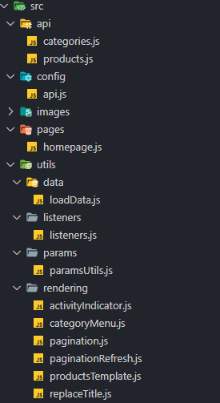

  

# Project: Ecommerce Test Frontend

Este frontend fue desarrollado solo utilizando javascript, y consumiento las API del backend que se realizó en paralelo.

<b>Link repositorio del backend:</b>
https://github.com/Lea23VC/ecommerceBackendTest

<b>Link deploy frontend en Vercel:</b>
https://ecommerce-frontend-test.vercel.app

## Recursos utilizados

- Tailwind
- Bootstrap (para formulario de busqueda y dropdown)
- FontAwesome
- Font Poppins de Google Fonts
- Tienda de referencia: https://themes.shopify.com/themes/fresh/styles/sweet/preview

## Estilos

En este proyecto no se hizo uso directo de un archivo CSS de estilos o estilo "inline", sino que se utilizó en su totalidad Tailwind.

## Uso de la tienda 

Esta es la pagina principal, la barra verde arriba es solo estetico, al igual que todos los links en la barra de navegación, a excepción de las categorías.

### Filtrar por categoría

Para filtrar los productos por categaría, se pueded realizar de dos formas:

- Hover en la sección de Tienda en la barra de navegación. Así apareceran las categorías disponible, incluyendo "Todo", el cual elimina los filtros de la busqueda.

- A través del panel izquierdo al lado de los productos.

La categoría actual quedará marcado en negrita y color rosa. Al usar un filtro de categoría, no se hace uso de los filtros actuales ya aplicados, tales como busqueda por nombre, orden segun precio, descuento o paginación.

### Busqueda por nombre

Para realizar una busqueda por nombre, se utiliza el "formulario" en el panel izquierdo de los productos, haciendo click en el icono de lupa o presionando Enter.

Este realiza una busqueda utilizando las palabras ingresadas y son mostrados los productos. 

Para eliminar la busqueda actual, se hace click a la "X" del formulario, al lado del icono de busqueda.

Al realizar una busqueda por nombre, se mantienen los filtros actuales utilizados, a excepción de la paginación.

### Orden de productos

Se pueden ordenar los productos actuales, por nombre, precio y descuento, de forma descendiente o ascendiente, a través del dropdown en el panel izquierdo al lado de los productos. Tambien esta la opción de "Sin orden" para limpiar este filtro.

Al cambiar el orden de productos, se mantienen los filtros actuales utiizados, a excepción de la paginación.

### Paginación

Por defecto, la cantidad por pagina de productos es de 6. Para cargar mas, se hace uso de la paginación que esta abajo del grid de productos. Al hacer uso de este, se puede navegar entre las paginas de productos actuales.

Al hacer uso de la paginación, se mantienen todos los filtros actuales de la busqueda.

### Responsive

La pagina es totalmente responsiva y funcional, cambiando la cantidad de productos por fila según la pantalla, y otros detalles.

⁃ ⁃ ⁃ ⁃ ⁃ ⁃ ⁃ ⁃ ⁃ ⁃ ⁃ ⁃ ⁃ ⁃ ⁃ ⁃ ⁃ ⁃ ⁃ ⁃ ⁃ ⁃ ⁃ ⁃ ⁃ ⁃ ⁃ ⁃ ⁃ ⁃ ⁃ ⁃ ⁃ ⁃ ⁃ ⁃ ⁃ ⁃ ⁃ ⁃ ⁃ ⁃ ⁃ ⁃ ⁃ ⁃ ⁃

## Javascript y consumo de API

El archivo js principal del proyecto se encarga de renderizar en un determinado div, el contenido, en este caso, los productos y las categorias. Esto realizando busqueda de elementos por ID o clase, tomando sus valores y haciendo uso de estos, ante de la dificultad de no usar un entorno como Node. 

El consumo de API se realiza en diferentes archivos, donde los parametros de busqueda de los productos son recibidos a través del archivo js principal. 

Los archivos principales son:

- src/api/categories.js: Retorna las categorias haciendo consumo de la API.
- src/api/products.js: Retorna los productos, pudiendo hacer uso opcional de parametros de busqueda, haciendo consumo de la api.
- src/pages/homepage.js: Archivo principal. Se encarga de renderizar en el html los productos y categorias de forma dinamica. 
- src/utils/paramsUtils.js: Se encarga de tomar los parametros de busqueda desde el navegador, editarlos o borrarlos.
- src/config/api.js: Archivo de configuración de la API, solo contiene la url del backend, el cual se usa en products.js y categories.js

_________________________________________________
Powered By: [postman-to-markdown](https://github.com/bautistaj/postman-to-markdown/)
